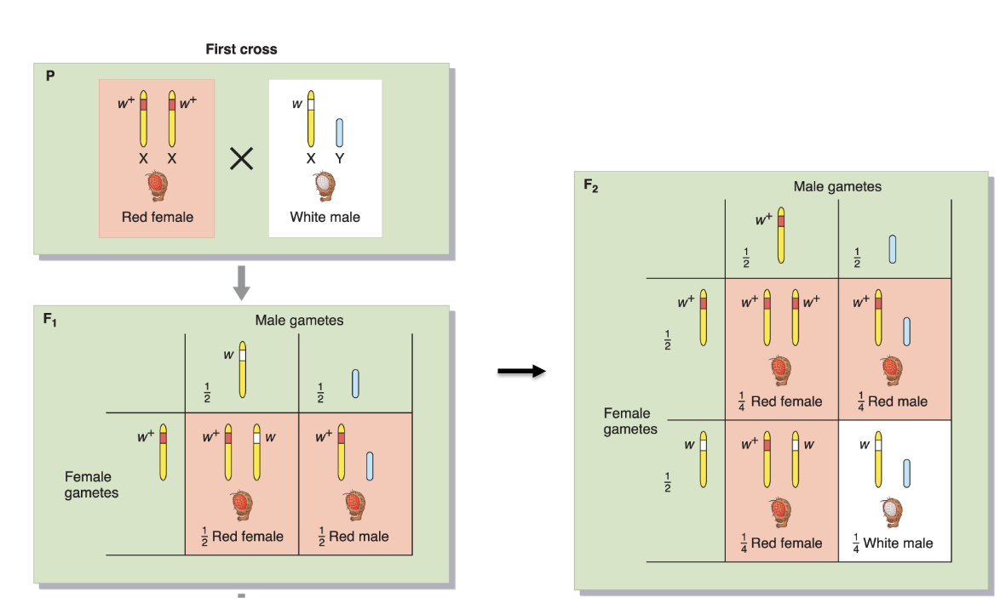
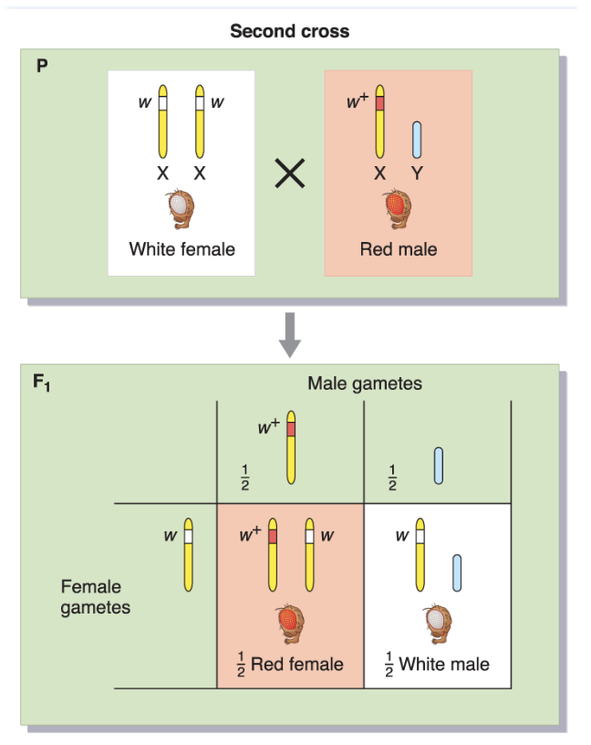
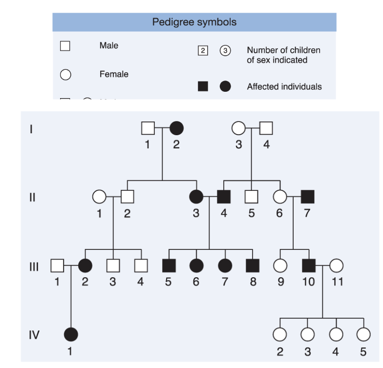
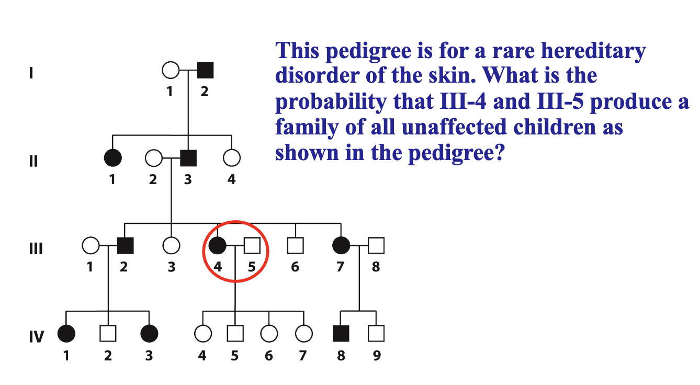
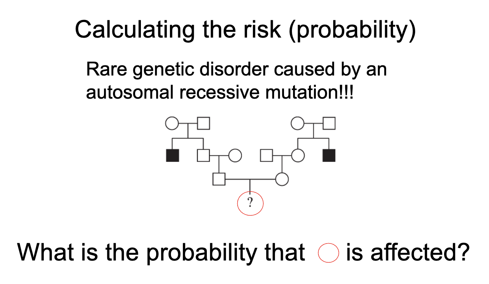

# Lecture 3 - Chromosome theory of inheritance

* Chromosomes, like Mendel's "elements" come in matched pairs

### Wild-type flies (Drosophilia) while eyes and red eyes example

* recessive white
* monohybrid cross (prediction vs actual result)
* Drosophila chromosomes in females and males

  * pattern of W inheritance resembles how the X chromosomes are sorted during meiosis
    **MENDEL'S EXPERIMENT 1**
  * 

    * In F1, all drosophilias (whether male or female) will have red eyes
    * In F2, male drosophilias have a chance of having white eyes

    **MENDEL'S EXPERIMENT 2**
  * 
* You can't do this experiment on humans, but how does it apply to humans -> pedigree

### Pedigree

* Recessive
  * you can't have two parents who are not affected, but have a child affected (ex: I3 and I4 having II4 whos affected)
* Autosomal
  * recessive, check III1 and III2 -> IV1
* Common
  * given that it's recessive, when it's often a disease that comes in the family, it is assumed to be common

* Given important info : its a **rare hereditary disorder**
  * it is dominant
* What is the probability that II4 and III5 produce a damily of all unaffected children as shown in the pedigree?
  * III4 only has one affected dominant pair (D/d) and III5 is recessive (d/d)
  * Each time they have a child, child has 1/4 chance of being affected
  * there are 4 children -> 1/4 * 4 = 1/16

* **autosomal recessive** -> so we don't care about X and Y chromosomes
* **rare** genetic disorder
* from II1, we can deduce that I1 and I2 are carriers
* II2 is healthy
  * 2/3 completely healthy and 1/3 carrier
  * we can eliminate the 4th possibility that he is not healthy (so not 1/4)
* III1 has 1/2 chance of being affected
* same thing on both sides
* -> 1/4
