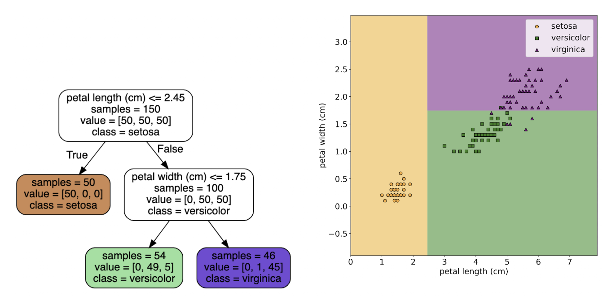

# Lecture 1 - Module 1.1 Introduction of machine learning

## What is Machine Learning?

* Detect patterns, extracting them to make sense of big data (ex: genomes, cells, EHRs, articles like wikipedia, video contents like thos on YouTube)
  * In this course, we will learn  "HOW"
  * Which model is appropriate for which situation
* Relation between ML and other fields
  * AI: broader field
  * Data mining: focus on heuristic while ML is more about the principle
  * Data science: similar to data mining, main purpose is to gain information

### Supervised Learning (Modules 1-6)

* most common form: f(X) -> y
* often fixed dimension
* inputs, outputs, training set
* Classification
  * input has different features
  * output space is a set of C unordered and mutually exclusive labels known as **classes**
  * in the iris examples, D=4, N=150, x E R ^(4*150), y E R ^(4*1), Y E R ^(4*3)
  * There is also binary classification
  * We can classify with a decision tree using ranges, or also using bounds
    * 
  * Image classification
    * image data represented as matrix
    * ex: helps recognize hand-writting
  * Image captioning
    * consider this as a supervised model
    * describe the content of an image
    * 
* Regression
  * predict real-valued quantity
  * > **No free lunch theorem:**
    > No models are wrong, but some models are useful - George Box
    >
  * You can have multiple linear regression
* Overfitting and generalization
  * the higher degree is the polyn, the more flexible is the model (fits better)
  * but if its too high, it will fit every single data points (generalized really poorly)
  * overfitting can occur in both classification and regression

### Self-supervised learning (Module 5.4)

* What to do if you dont have enough labels for all the info out there -> seld-supervised learning
  * Compared to supervised learning where theres a human labelling everything, self-supervised "guesses / predicts" using the closest/highest probability output
* ex: Generative Pre-training Transformer (GPT)
  * Decode -> pick word with the highest probability, (goes on with every single word) -> generate sentences
  * Fine-tuning : proven better than training froms scratch
    * reinforced learning (theres a human correcting the model)
* LLMs
* BERT
  * instead of making the model predict next token and so on, we mask a token and make the model predict the masked token

### Unsupervised learning (Module 7)

* You dont have labels
* Older type category of self-supervised
* Try to train a model to explain a pattern
* > “When we’re learning to see, nobody’s tellingus what the right answers are – we just look.  Every so often, your mother says“that’s a dog”, but that’s very little information.”  -Geoffery Hinton 1996
  >
* Clustering
  * K-means clustering
    * clusters with a center
    * 
  * Hierarchical clustering
    * tree. Can be bottom-up or top-down
    * 
* Autoencoder

