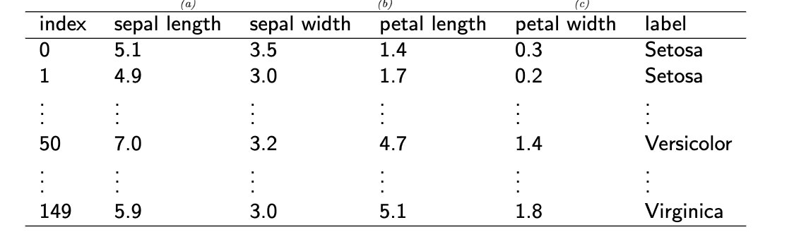

# Lecture 2 - KNN

* KNN is supervised learning

Pop quiz:

* 
  * Input dimension: 4
  * Number of training example N: 150
  * Value stored in x1^(50): 3.2
  * Value stored in x[1,3]: 0.2
    * [row, column]
  * X E R^(150*4)
  * Y E R^(150*1)

## Pairwise distance

* Key step in KNN in predicting new data point x^(*) is to [find the K most similar examples]() in the training set using *Euclidean distance*
